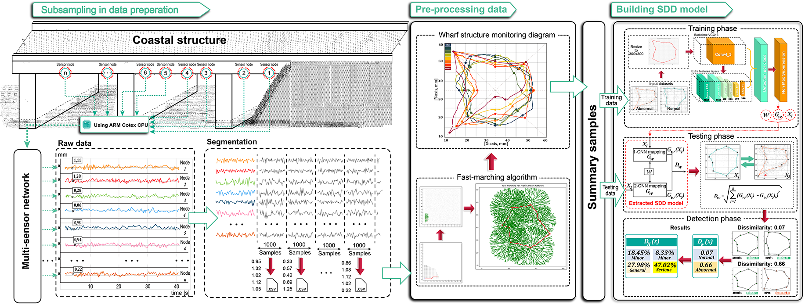

# Non-parametric Vibration-based Structural Damage Detection for Coastal Structures: Multi-Dimension to Single Input Convolutional Neural Network Approach
## _AIT Research Group_

[](https://travis-ci.org/joemccann/dillinger)

## FMA-SCNN Overview


## Run codes
Install lib-package to run Fast Marching Algorithm
```bash
cd scr/FastMarchingAlgorithm
```

```python
!pip install -r requirements.txt
```
Install lib-package to run SCNN
```bash
cd scr/SCNN
```

```python
!pip install -r requirements.txt
```

## License

MIT

**@ AIT Research Group**
